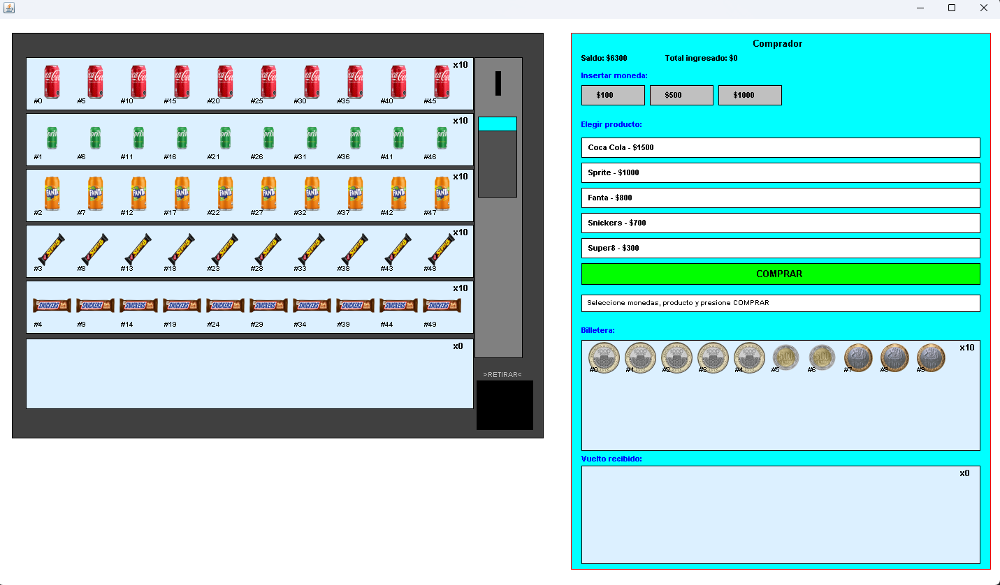

# Tarea 3: GUI Expendedor de Bebidas y Dulces 

## Integrantes

- Agustin Andres Baeza Mansilla
- Alan Ignacio Flores Yerey
- Ignacio Esteban Placencia Palma

---

## Descripción del Proyecto

El Proyecto consiste en una GUI desarrollada en Java de una máquina expendedora de Productos (Bebidas y Dulces) con un comprador interactivo que dispone de una billetera virtual y un sistema de vuelto, en el expendedor virtual se encuentran 5 Productos disponibles a escoger (Coca Cola, Fanta, Sprite, Snickers, Super8), cada uno con su respectivo valor. El sistema corresponde a una extensión de la lógica implementada en Tarea 1 con adiciones para el correcto funcionamiento de la Interfaz Gráfica, respetando la separación entre Modelo-Vista.

El usuario puede seleccionar monedas de su billetera, elegir un producto y ejecutar la compra. El expendedor descuenta el producto de su depósito, deposita el vuelto correspondiente y el comprador lo recoge automáticamente.

## Cómo ejecutar

Desde Main.java se realiza la ejecución del programa.

---

## Diagrama UML

---

## Captura de la Interfaz

---

## Cómo usar la aplicación

### Realizar la compra de un Producto

1. Selecciona una o más monedas en el apartado "Insertar Moneda" clickeando sobre la opción deseada (insertar una moneda de $100, $500 o $1000), el valor de las monedas totales insertadas no debe superar el saldo disponible o la cantidad disponible de dicha moneda.
2. Selecciona el producto que deseas comprar en el apartado "Elegir Producto", en él aparecen sus precios respectivos.
3. Presiona el botón COMPRAR.
4. Si la compra es exitosa, el producto escogido aparece en la bandeja de retiro del expendedor y el vuelto va al depósito de vuelto del comprador correspondiente a "Vuelto Recibido".

### Funcionalidades adicionales

- Rellenar los depósitos vacíos: Click en el fondo del expendedor.
- Retirar el producto de la bandeja: Click en la ranura negra con el producto comprado.

---

## Decisiones de Diseño Clave

1. Separación Modelo-Vista: El código de la Tarea 1 se mantiene intacto en el package Logica con leves adiciones para que funcione correctamente la interfaz gráfica, pero sin incluír componentes directamente de librería Swing. El package GUI lo usa como modelo sin modificarlo, siguiendo la separación de ambas responsabilidades.

2. paintComponent propios: Tanto PanelDeposito, PanelExpendedor y PanelComprador poseen sus propios paintComponent que detallan el dibujo para la interfaz que debe unificarse en PanelPrincipal.

3. Implementación de Depósito de retiro: DepositoRetiro implementa el depósito de capacidad uno sin ArrayList, con la finalidad de almacenar el producto comprado y que el usuario pueda extraerlo del expendedor al realizar su compra.

4. Compra con múltiples monedas: Expendedor recibe una ArrayList de Moneda y suma el total antes de verificar si alcanza el precio, permitiendo combinar varias monedas en una compra, que simula lo que es en la vida real insertar varias monedas a una maquina expendedora para alcanzar el precio del producto.

5. Números de serie únicos: Cada Producto y cada Moneda tiene un número de serie único asignado desde un contador estático en el Expendedor. Los números de serie se muestran gráficamente debajo de cada imagen.

6. Ordenamiento de Monedas: Las Monedas se ordenan según su valor en la billetera y los depósitos de vuelto y recaudación. 

7. Enumeraciones Personalizadas: Creación de enumeraciones para setear dimensiones estándar de las imágenes de los Productos

8. Dibujo de Productos: Los Productos son dibujados a través de la carga de la imagen .png respectiva de ellos.
